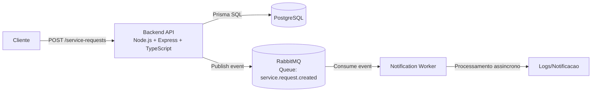

# Diagrama de Arquitetura - Sprint 2

## Leitura rapida

- A API salva dados no PostgreSQL e publica evento no RabbitMQ.
- O worker consome o evento em processo separado.
- O cliente recebe resposta HTTP antes do fim do processamento do worker.

## Protocolos

- Cliente -> API: HTTP/JSON
- API -> Banco: SQL/TCP (Prisma)
- API -> RabbitMQ: AMQP (publish)
- RabbitMQ -> Worker: AMQP (consume)
