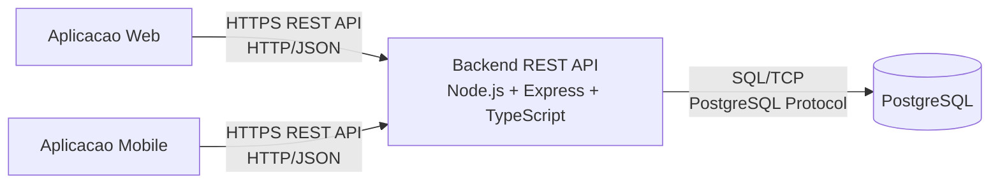

# Arquitetura do Sistema

## Leitura rápida

- As aplicacoes web e mobile consomem a mesma API por HTTPS e JSON.
- O backend usa Node.js, Express e TypeScript.
- A persistência é feita em PostgreSQL.

Observacao: RabbitMQ ou outra camada de mensageria pode ser adicionada como evolucao futura, mas nao foi implementada na versao atual.

## Legenda técnica

- HTTPS REST API e HTTP/JSON: comunicação entre aplicativos e backend
- SQL/TCP e PostgreSQL Protocol: comunicação entre backend e banco
